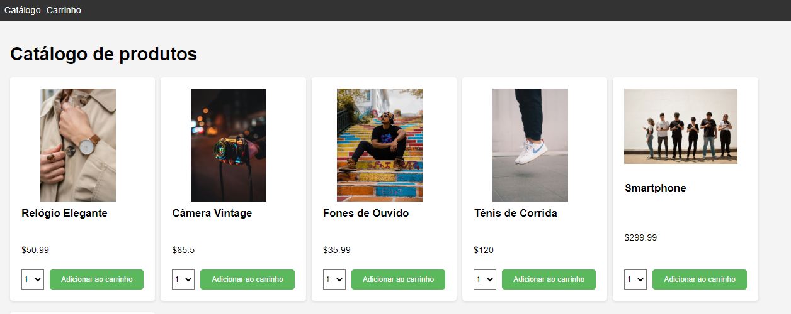
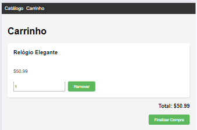
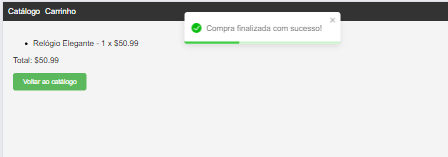

# Projeto Carrinho de Compras (e-commerce)

Este projeto foi desenvolvido durante o curso 
<a href="https://www.udemy.com/course/react-js-com-typescript-direto-ao-ponto-c-projetos">
React JS com-TypeScript Direto ao Ponto com Projetos</a>, do professor Matheus Battisti (Hora de Codar).

A interface do usuário tem uma tela inicial com um catálogo de produtos:

O usuário adiciona o produto ao carrinho:

Pode remover o item, alterar a quantidade ou finalizar a compra:

Em todas as ações é apresentada uma mensagem ao usuário (toast).

